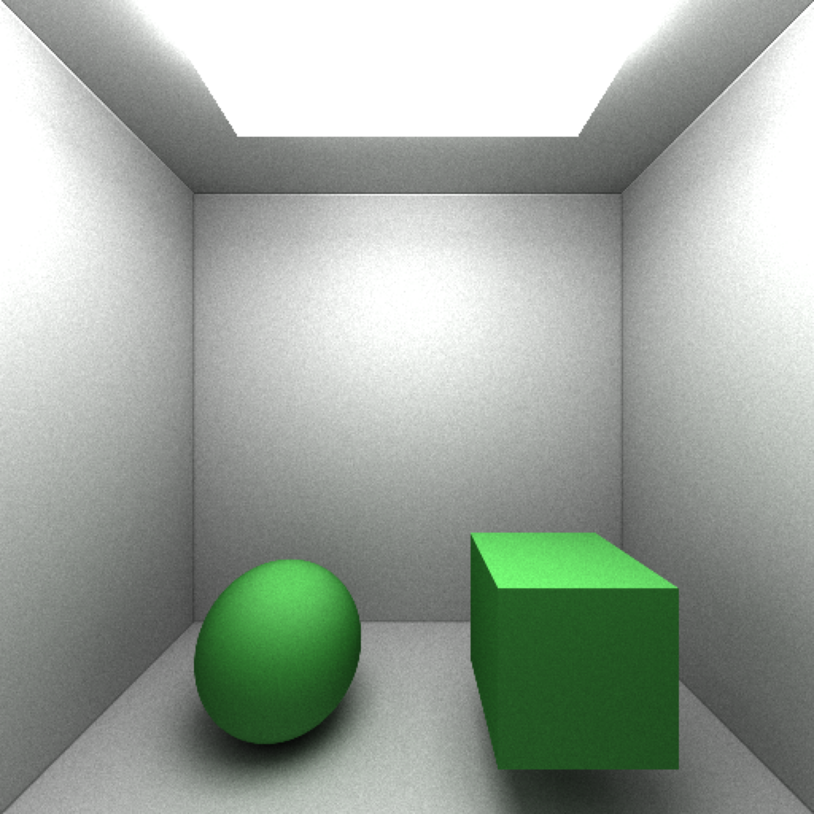

# Raytracing benchmark

A simple path tracer written as a benchmark for my blog post, https://webkit.org/blog/10298/inline-caching-delete/

[WebArchive link](https://github.com/justinmichaud/js-bench-raytrace/raw/main/A%20Tour%20of%20Inline%20Caching%20with%20Delete.webarchive)
